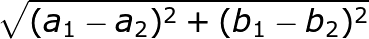
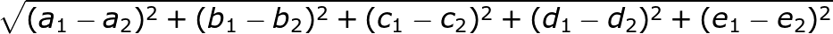

1. KNN(K-Nearest Neighbors Algorithm) 알고리즘이란
    1. 그래프에 점이 있을 때, 가까운 이웃이 많이 소속된 곳이 해당 점의 소속이라고 판단하는 알고리즘.
    2. 이 때, 그래프는 자료 구조의 그래프가 아니고, 2차원 평면 그래프다~
    3. 거리 측정은 피타고라스 정리를 쓰면 된다.

        

    4. 특징이 많을 수록 n차원 그래프가 되버리는데, 거리 측정 공식은 똑같다.

        

2. KNN으로 추천 시스템 만들어보기
    1. 취향이 비슷한 고객을 그래프에 표현하면 가까울 것이다. 이 때, 비슷한 고객이 좋아한 영화를 가까운 이웃 고객에게도 추천하는 방식으로 프로그래밍하면, 추천 시스템이다 :fire:
    2. 고객 사이의 유사도는 어떻게 구할까? 특징을 추출해야 한다! 특징을 추출해서 고객의 좌표를 결정하면, 두 고객 사이의 거리는 피타고라스 정리를 활용하여 구할 수 있다.
    3. 영화의 경우, `코미디`, `액션`, `드라마`, `공포`, `로맨스` 등의 고객이 좋아하는 장르에 직접 매긴 점수로 고객의 좌표를 결정할 수 있다.
    4. `더 많은 영화를 평가해 주세요. 여러분이 더 많은 영화를 평가할수록 추천 영화가 더 정확해 집니다.`
    5. __이것은 KNN 알고리즘의 능력 중 하나인 분류이다. 분류는 그룹으로 나누는 일이다.__

3. 회귀 분석으로, 고객이 매길 평점이 몇 점일지 예상해보기
    1. 어떤 영화에 대해 어떤 고객이 어떤 평점을 줄 지 예상하는 일
    2. 어떤 고객과 가장 유사한 K명의 데이터를 모은다.
    3. k명의 고객이 매긴 평점의 평균을 구한다. `avg({ 저스틴: 5, 제이: 4, 조이: 4, 랜스: 5, ...}) = 4.5` 이다. 어떤 고객이 매길 평점은 아마 4.5점일 것이다.
    4. __이것은 KNN 알고리즘의 능력 중 하나인 회귀 분석이다. 회귀는 (숫자로 된) 반응을 예측하는 기법이다.__
    5. 회귀 분석은 매우 쓸모가 있는데, 예측에 많이 사용할 수 있기 때문이다 :sparkles:

4. 회귀 분석으로, 오늘 빵이 몇 개나 팔릴지 예상해보기
    1. 지금까지 쌓인 판매 데이터를 이용해 내일 얼마나 팔릴까?
    2. 데이터의 특징 = `1~5점으로 표현한 날씨(1=worst, 2=best)`, `주말여부(주말 = 1, 평일 = 0)`, `스포츠 경기가 있는 날인지(있음 = 1, 없음 = 0)`
    3. 이 데이터를 갖고, KNN 알고리즘으로 이웃을 찾고, 평균을 낸다.
    4. `avg({ 300, 75, 200, 50}) = 218.75`개를 팔 것이다.

5. 분류할 때 (거리를 잴 때), `코사인 유사도`라는 개념도 있다. 두 고객이 아주 비슷하지만 (취향이 비슷하지만) 단순한 거리 공식을 사용하면 이웃이 되지 않을 수 있다. 이 때 코사인 유사도를 사용하면, 두 벡터의 거리를 측정하지 않고 두 벡터 사이의 각도를 측정하게 되고 이 경우에는 코사인 유사도가 더 적합한 방법이 된다. - 내용은 몰라서 나중에 정리하겠음 :smile:

6. 좋은 특징을 고르는 방법:
    1. KNN을 사용할 때는 올바른 특징을 고르는 것이 중요하다.
    2. 편향되지 않은 특징
    3. 직접 관련이 있는 특징
    4. 과연 `평점`이 추천 할 때의 최선의 기준일까?
    5. 좋은 특징을 고르는 데 있어 정답은 없다. 여러 가지 다른 관점에서 모두 살펴보아야 한다.

7. KNN은 머신러닝이다.
    1. OCR은 광학적 문자 인식이라고 하는데, 사진 속의 글자를 인식하는 것이다.
    2. KNN을 사용해서 그림이 무슨 숫자인지 컴퓨터가 알게 하려면,
    3. 여러 가지 문자 그림을 살펴보고 그림들의 특징을 뽑아낸다.
    4. 새로운 그림이 주어지면 그 그림의 특징을 뽑아서 가장 가까운 것들을 살펴본다.
    5. OCR에 사용되는 특징의 추출은 훨씬 복잡하지만, 음성 인식, 얼굴 인식 등에도 같은 간단한 원리가 적용되고 있다.
    6. OCR 구현의 첫 번째 단계는 그림으로부터 특징을 추출하면서 모든 데이터를 살펴보는 것인데 이것을 트레이닝이라고 한다. 컴퓨터가 어떤 일을 하려면 반드시 트레이닝 단계를 거쳐야 한다.

8. KNN의 응용: 스팸 필터링
    1. 스팸 필터는 `Naive Bayes Classifier`라고 하는 간단한 알고리즘을 사용한다.
    2. 데이터로 Naive Bayes Classifier를 트레이닝하면 끝!
    3. 아주 효과적이면서 간단한 알고리즘이다 :smile:
